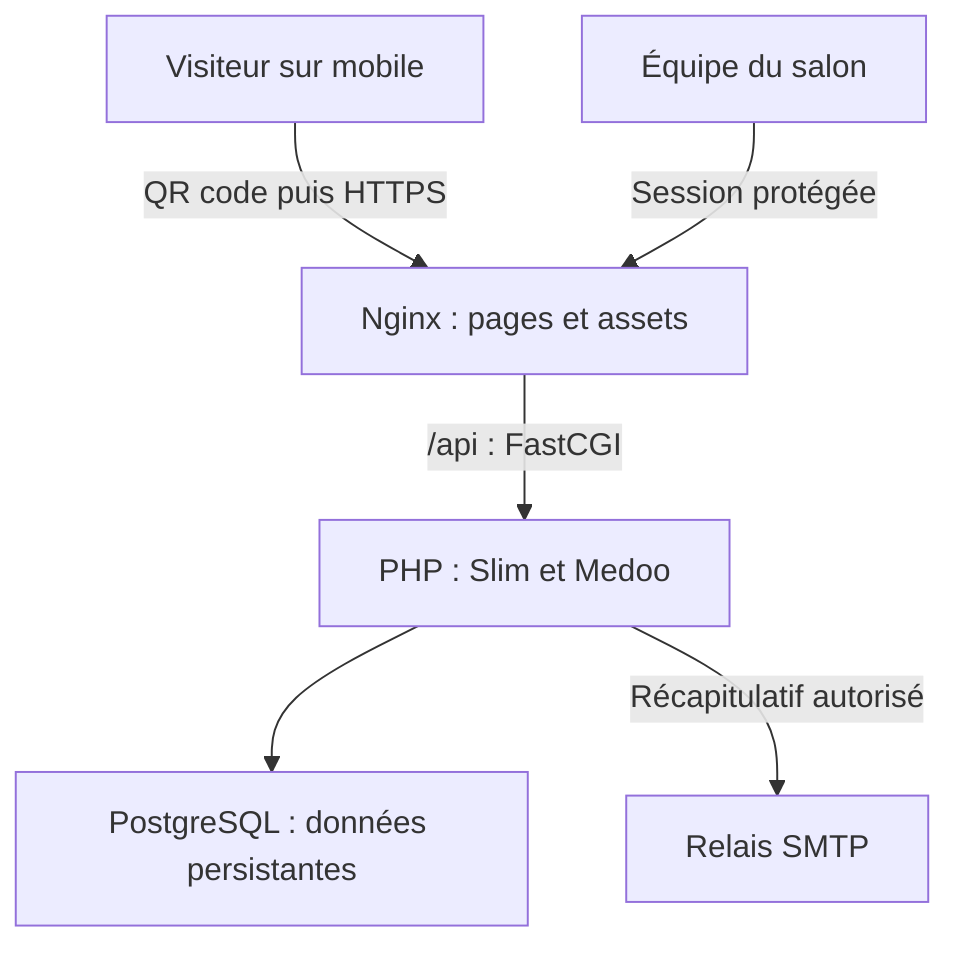

# Mediaschool Board by Iris Nice

[](https://github.com/AstrowareConception/Mediaschool-Board-by-Iris-Nice/actions/workflows/ci.yml)

**Mini-projet BTS SIO, deuxième année — livraison pour le salon Studyrama du samedi 3 octobre 2026.**

Vous réalisez en équipe une application mobile de collecte des visites au salon. Le visiteur scanne un QR code, renseigne son projet de formation et reçoit une confirmation. L’équipe du salon consulte les fiches dans un espace protégé, compte les visites par école et niveau, exporte le récapitulatif en CSV/PDF et peut l’envoyer à une adresse autorisée.

Le vendredi 2 octobre constitue une journée de réalisation avec une échéance réelle. Votre objectif est une **version simple, vérifiée et transmissible au responsable d’infrastructure**. Le responsable ou les étudiants SISR assurent l’hébergement ; les SLAM livrent un paquet reproductible et les informations nécessaires.

> **Ce dépôt est un starter, pas l’application terminée.** Docker, Slim, Medoo, les référentiels du formulaire, les sessions et des exemples sont fournis. La sauvegarde des inscriptions et les routes métier sont à développer. Les réponses 501 et l’ouverture désactivée sont volontaires. Ne collectez pas de vrais visiteurs avec cette version.

## Étudiant : commencez ici

1. Lisez [le besoin et les règles métier](docs/01-besoins.md), puis [l’organisation de la journée](docs/02-organisation.md).
2. Inscrivez votre nom, votre mission principale et votre binôme de revue dans [la répartition nominative](livrables/REPARTITION.md). Aucun étudiant ne doit rester sans tâche identifiable.
3. Suivez le [démarrage pas à pas](docs/03-demarrage.md). Vérifiez que le formulaire charge ses listes et que `/api/health` répond.
4. Ouvrez **votre fiche de pôle** ci-dessous. Prenez une tâche du [backlog](docs/08-backlog.md), écrivez son identifiant dans votre branche et votre PR.
5. Avant de coder à plusieurs, respectez [le contrat d’API](docs/05-contrat-api.md) et [les règles de données](docs/04-donnees-merise.md).
6. Livrez code **et preuve de test**. Complétez votre [fiche individuelle](livrables/individuel/MODELE.md) ; les productions collectives seules ne prouvent pas votre contribution.

| Votre pôle | Votre point d’entrée | Votre résultat concret |
|---|---|---|
| Pilotage / intégration | [Fiche pilotage](docs/poles/01-pilotage.md) | Besoin compris, tâches attribuées, intégration régulière, décisions tracées |
| Merise / PostgreSQL | [Fiche données](docs/poles/02-merise.md) | MCD, MLD, dictionnaire, migration, requêtes et contraintes |
| Front public | [Fiche formulaire](docs/poles/03-front-public.md) | Formulaire mobile accessible, erreurs et confirmation réelle |
| Backend / sécurité | [Fiche API](docs/poles/04-backend.md) | Validation, insertion, consultation protégée, contrôle des accès |
| Back-office / exports | [Fiche tableau de bord](docs/poles/05-backoffice.md) | Liste, détail, récapitulatif, téléchargements et envoi |
| Qualité / infrastructure | [Fiche recette et SISR](docs/poles/06-qualite-infra.md) | Tests, paquet de livraison, HTTPS, sauvegarde/restauration, QR code |

Un pôle n’est pas une personne unique et un étudiant peut travailler dans deux pôles. Le coordinateur conserve une tâche technique personnelle. Si vous êtes peu nombreux, regroupez les pôles ; si vous êtes nombreux, découpez par tâche et par écran, jamais en plusieurs applications incompatibles.

## Démarrage rapide

Prérequis : Git et Docker Desktop avec Docker Compose v2. Aucune installation locale de PHP ou PostgreSQL n’est nécessaire.

```bash
git clone https://github.com/AstrowareConception/Mediaschool-Board-by-Iris-Nice.git
cd Mediaschool-Board-by-Iris-Nice
cp .env.example .env
docker compose up -d --build --wait
docker compose exec api php bin/create-admin.php equipe
docker compose exec api composer test
docker compose exec api composer smoke
```

**Correctif Windows du 2 octobre :** le démarrage est vérifié avec un script LF et avec le même script converti en CRLF. Pour un kit déjà cloné : `git pull --ff-only`, puis `docker compose up -d --build --force-recreate --wait`. Voir [les résultats de la recette](docs/12-validation-starter.md).

Sous PowerShell, remplacez `cp` par `Copy-Item .env.example .env`. Ouvrez [http://localhost:8080](http://localhost:8080), puis [l’espace équipe](http://localhost:8080/admin.html). Le mot de passe est demandé dans le terminal et n’apparaît pas dans l’historique.

## Ce qui est fourni et ce que vous devez produire

| Fourni et fonctionnel | À réaliser par les étudiants |
|---|---|
| Trois services Docker, migrations versionnées, volumes persistants | Schéma métier des inscriptions, MCD/MLD justifiés |
| Slim 4 + PSR-7 + Medoo + PDO PostgreSQL | Validation métier, insertion, doublons et consultation |
| Référentiels fidèles au PDF : écoles, classes, niveaux, spécialités | Règles de compatibilité uniquement si validées par la directrice |
| Session, login/logout, CSRF, protection des routes admin, limite de connexion | Vérification des protections, sécurité des nouvelles routes |
| Formulaire responsive Tailwind/daisyUI, chargement des listes, client fetch | Erreurs par champ, confirmation, contrôle des doubles envois et recette mobile |
| Page admin avec connexion et structure de tableau de bord | Liste/détail, filtres, vrais compteurs, exports et envoi |
| Dompdf/PHPMailer installés, exemples CSV/PDF et envoi encadré | Branchement sur les résultats SQL, routes et interface |
| Tests du socle et CI | Tests métier, recette complète et rapport signé |
| Procédures de livraison et scripts de sauvegarde | Exécution sur la cible, restauration testée, URL finale et QR imprimé |

## Navigation du guide

- [01 — Besoin, périmètre, hypothèses et critères de succès](docs/01-besoins.md)
- [02 — Organisation, planning, règles Git et responsabilités](docs/02-organisation.md)
- [03 — Installation, commandes et diagnostic](docs/03-demarrage.md)
- [04 — Merise, dictionnaire et PostgreSQL](docs/04-donnees-merise.md)
- [05 — Contrat API et exemples de requêtes](docs/05-contrat-api.md)
- [06 — Front mobile sans maquettes : parcours et composants](docs/06-front.md)
- [07 — Tests, sécurité et recette](docs/07-tests-securite.md)
- [08 — Backlog prêt à répartir](docs/08-backlog.md)
- [09 — Packaging, transmission et exploitation](docs/09-deploiement.md)
- [10 — Compétences BTS SIO et preuves individuelles](docs/10-competences-bts.md)
- [11 — Mode d’emploi pour l’équipe du salon](docs/11-guide-utilisateur.md)
- [12 — Vérifications du starter et limites de cette validation](docs/12-validation-starter.md)
- [Sources et transcription du formulaire](docs/sources/README.md)

## Architecture commune à toutes les équipes



Une seule origine publique pour le front et l’API. PostgreSQL et PHP-FPM ne sont pas publiés sur Internet. Le QR code est un simple lien vers l’URL finale : il ne contient aucune donnée personnelle.

**Fin du projet :** une autre personne doit pouvoir déployer votre version à partir du tag, créer son compte, restaurer une sauvegarde et utiliser le service avec votre documentation. Voir la [checklist de livraison](livrables/deploiement/CHECKLIST.md).
