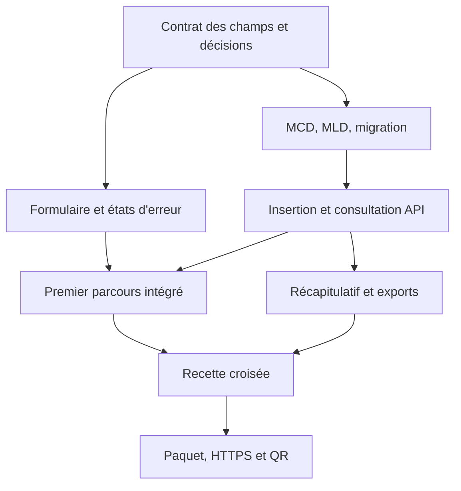

# 02 — Organiser une équipe qui livre ensemble

## Avant la première ligne de code

Le professeur attribue ou valide les pôles. Chaque étudiant inscrit dans `livrables/REPARTITION.md` son nom, une tâche précise, les fichiers visés, une preuve attendue et un relecteur. L’effectif exact n’est pas présumé : le tableau possède autant de lignes que nécessaire.

Les pôles sont des responsabilités de production, pas des silos. Une fiche d’inscription traverse données, API, front et tests. Le coordinateur vérifie ce passage au lieu d’attendre la fin pour assembler les travaux. **Chaque étudiant doit développer, modéliser, tester ou déployer quelque chose d’identifiable**, y compris les étudiants chargés de coordonner.

| Pôle | Charge indicative | Avec qui travailler immédiatement | Point de passage |
|---|---:|---|---|
| Pilotage/intégration | 1 étudiant, avec une tâche technique | Tous les référents | Noms attribués et contrat partagé |
| Merise/PostgreSQL | 1 à 2 | API et statistiques | Migration métier validée rapidement |
| Front public | 2 | API et recette mobile | Premier envoi réel |
| API/sécurité | 2 à 3 | Données, formulaire, back-office | Sauvegarde et lecture protégée |
| Back-office/exports | 2 à 3 | SQL, API et directrice | Totaux/export identiques |
| Qualité/infrastructure | 1 à 3, SLAM/SISR selon disponibilité | Tous, puis exploitant | Recette et installation sur cible |

À 6 étudiants : fusionnez pilotage avec QA, front public avec back-office, données avec API. À 12 étudiants : séparez formulaire/erreurs, insertion/consultation, tableau/export, tests/déploiement. À un effectif supérieur, ajoutez des binômes de tests et des responsabilités précises ; n’ouvrez pas de chantier hors périmètre.

## Déroulé proposé pour une journée de 7 heures

Adaptez aux horaires réels. Les durées sont du temps de travail, hors pauses. Le responsable d’infrastructure réserve la cible et le domaine au début de la journée, pas après la recette.

| Temps cumulé | Durée | Travail et résultat observable |
|---|---:|---|
| 0:00–0:30 | 30 min | Lire la demande, démontrer le starter, attribuer les noms et tâches |
| 0:30–1:15 | 45 min | MCD/MLD en binôme, règles de doublon, API et parcours ; valider les points bloquants |
| 1:15–2:00 | 45 min | Migration métier, insertion minimale et premier envoi du formulaire jusqu’à PostgreSQL |
| 2:00–3:30 | 90 min | Validation complète, erreurs front, consultation authentifiée, tests en parallèle |
| 3:30–4:30 | 60 min | Statistiques, CSV/PDF, branchement SMTP ; première installation sur cible de test |
| 4:30–5:30 | 60 min | Recette croisée, tests d’accès, doublons, exports, responsive, corrections |
| 5:30–6:15 | 45 min | Gel métier, installation cible, HTTPS, sauvegarde/restauration sur environnement de test |
| 6:15–7:00 | 45 min | QR réel, démonstration à l’équipe, manuel, paquet et preuves individuelles |

Trois rendez-vous de dix minutes, inclus dans ces temps : après la conception, au premier parcours complet, avant la bascule. Chaque pôle dit « terminé / restant / obstacle / aide attendue », en montrant une preuve. Un pourcentage sans preuve n’est pas un indicateur utile.

## Dépendances à traiter



Le front peut avancer avec les référentiels et les exemples de réponses. Tout mock doit être explicitement marqué et supprimé de la livraison. Le pôle statistiques utilise une requête définie avec le pôle données : trois calculs différents dans le front, le PDF et le CSV créeraient des incohérences.

## Git : une intégration régulière

```bash
git switch main
git pull --ff-only
git switch -c feat/API-01-validation
# travail et tests
git add backend/src/RegistrationValidator.php backend/tests/
git commit -m "API-01 : valider les champs d’inscription"
git push -u origin feat/API-01-validation
```

Ouvrez une PR vers `main` et utilisez le modèle fourni. Indiquez le besoin, les changements, les fichiers de livrable et les tests observés. Le relecteur vérifie le contrat et essaie le parcours concerné. Le coordinateur intègre de petites PR testées ; il ne réécrit pas silencieusement le travail d’un autre.

- Une branche par tâche ou petit ensemble cohérent ; pas une branche personnelle contenant tout le projet.
- Avant d’éditer `src/app.php`, prévenez le référent API. Déplacez les routes métier dans des fichiers ou classes pour éviter les conflits.
- Avant d’éditer la même page, répartissez clairement formulaire, gestion des erreurs et API client.
- Aucun secret, export de vraies fiches ou capture nominative dans Git.
- Pas de force-push sur `main`, pas de suppression de volume pour « réparer » la production.
- Une migration appliquée ne se modifie plus : créez la suivante. En local seulement, une base de test jetable peut être reconstruite avec accord de son propriétaire.

## Preuve et définition de terminé

Une tâche est terminée si le résultat fonctionne, respecte le contrat, a été relu, a une preuve de test et est intégré. La fiche individuelle cite les commits/PR et explique une décision technique, un test normal, un test d’erreur et une difficulté résolue. Le code fourni dans ce starter ne doit pas être présenté comme une production personnelle.

`livrables/DECISIONS.md` garde les décisions métier. `livrables/tests/RAPPORT.md` garde les observations. Les problèmes utilisent le modèle d’issue : étapes, attendu, observé, environnement, données fictives. Le professeur tranche les arbitrages pédagogiques ; l’exploitant valide l’environnement et la directrice valide l’usage.
