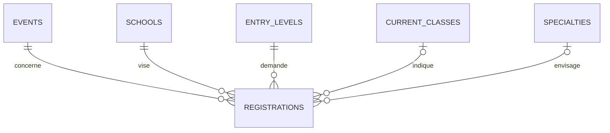

# 04 — Concevoir les données avec Merise

## Votre production précède votre migration

Les tables de référentiels et d’authentification sont fournies pour démarrer. **Le modèle d’inscription est votre travail.** Ne copiez pas un SQL incomplet en l’appelant MCD. Décrivez d’abord ce que représente une fiche : une personne renseignant un souhait de formation pour un salon, à un instant donné.

Pour la version courte, une table `registrations` portant les coordonnées et le souhait suffit. Un modèle `visitors` + `registrations` peut être défendu si vous gérez réellement plusieurs salons ; il ajoute de la synchronisation et ne doit pas faire perdre le parcours de vendredi. Justifiez le choix dans le dossier de conception.

## MCD : entités, associations, cardinalités

Listez les entités candidates : salon, fiche/inscription de visite, école, niveau d’entrée, classe actuelle, spécialité. Le compte administratif est un objet technique distinct. Pour chaque association, formulez les deux sens : « une fiche concerne exactement un salon ; un salon reçoit zéro à plusieurs fiches ».

| Association attendue | Côté fiche | Côté référentiel | Justification |
|---|---|---|---|
| Concerne salon | (1,1) | (0,n) | Même à zéro visite le salon existe |
| Vise école | (1,1) | (0,n) | École obligatoire, plusieurs personnes peuvent la viser |
| Demande niveau | (1,1) | (0,n) | Niveau obligatoire |
| Indique classe actuelle | (0,1) | (0,n) | Champ facultatif |
| Envisage spécialité | (0,1) | (0,n) | Indécision autorisée |

Produisez un **vrai MCD Merise** avec votre outil de cours : identifiants, propriétés, associations nommées et cardinalités. Exportez une image lisible et gardez le source. Le diagramme suivant explique les relations candidates ; sa notation ER n’est pas un MCD Merise à remettre tel quel.



## MLD et dictionnaire

Passez les relations en tables et marquez PK/FK, nullabilité, uniques et indexes. Les noms du contrat HTTP sont fixés ; le stockage peut être adapté si le mapping est explicite. Évitez un JSON géant qui empêcherait contraintes, regroupements et requêtes compréhensibles.

| Donnée | Stockage recommandé | Règle de contrôle |
|---|---|---|
| `id` | `bigint` identity, PK | Identifiant interne, pas une référence publique séquentielle |
| `reference` | `uuid` unique | Génération côté serveur, aucun accès public aux fiches via ce UUID |
| `event_id` | `integer`, FK, NOT NULL | Issu de la configuration serveur |
| `last_name`, `first_name` | `varchar(100)`, NOT NULL | Trim, non vide, accents permis |
| `birth_date` | `date`, NOT NULL selon décision | Date réelle non future ; pas un timestamp |
| `phone` | `varchar(30)`, NOT NULL selon décision | Jamais un entier ; formats internationaux |
| `email` | `varchar(254)`, NOT NULL | Valeur normalisée conservée, syntaxe contrôlée en PHP |
| `current_class_id` | `integer`, FK, NULL autorisé | Vide → `null`, pas ID 0 |
| `school_id`, `entry_level_id` | `integer`, FK, NOT NULL | Un ID inconnu est refusé |
| `specialty_id` | `integer`, FK, NULL autorisé | Facul­tatif |
| `remark` | `varchar(1000)` ou text avec CHECK | Texte brut, facultatif |
| `registered_at` | `timestamptz`, défaut serveur | Ordre de saisie fiable, affichage Europe/Paris |

Complétez le [modèle de dictionnaire](../livrables/conception/DICTIONNAIRE.md) : signification, exemple fictif, origine, contrôles PHP et SQL, sensibilité. Les références restent immuables pendant le salon. Toute suppression d’école utilisée doit être refusée ; pas de cascade qui effacerait des visiteurs.

## Doublon : ne vous contentez pas d’un SELECT avant INSERT

Deux requêtes simultanées peuvent toutes deux constater l’absence d’une fiche. **La base doit imposer l’unicité** sur l’identité retenue par salon. Exemple de piste : index unique sur `event_id`, `lower(trim(email))`, `lower(trim(last_name))`, `lower(trim(first_name))`. Ce choix conserve les accents et doit être appliqué de façon cohérente. Décidez si la normalisation plus forte est utile ; n’inventez pas une comparaison approximative des personnes.

L’API effectue l’INSERT, intercepte spécifiquement la violation d’unicité PostgreSQL (`23505`) et répond `409 DUPLICATE_REGISTRATION`. Elle ne transforme pas une erreur de connexion ou une FK invalide en « doublon ». Les deux personnes partageant l’adresse d’un parent doivent pouvoir être distinguées par les noms. Une retransmission du même formulaire ne crée pas une nouvelle fiche.

Une clé d’idempotence pour récupérer une confirmation perdue est une amélioration possible. Pour le MVP, affichez un message expliquant qu’une fiche existe déjà et demandez à l’équipe de vérifier, sans exposer son contenu dans l’API publique.

## Migration et jeu de données

Créez `backend/database/migrations/003_registrations.sql`. Les migrations se jouent dans l’ordre, une fois ; le checksum empêche de modifier une migration appliquée. Ajoutez ensuite `004_...sql` si vous changez le modèle. Les scripts init PostgreSQL ne sont pas votre outil de mise à jour.

Créez un jeu de test séparé, activé explicitement, contenant uniquement des données fictives avec des e-mails `example.test`. Il doit inclure : zéro puis plusieurs fiches, accents/apostrophes, facultatifs absents, même mail pour deux personnes, au moins deux écoles et niveaux. Aucun jeu de démonstration ne doit être injecté automatiquement sur la production.

## Requêtes à savoir écrire et expliquer

1. Insérer une fiche avec paramètres liés.
2. Lister les vingt dernières fiches d’un salon et paginer de façon stable : `ORDER BY registered_at DESC, id DESC`.
3. Lire une fiche du salon actif par son ID.
4. Filtrer école et niveau sans concaténer les saisies dans le SQL.
5. Regrouper par école et niveau et vérifier le total.

Exemple de requête à adapter **après** création du modèle :

```sql
SELECT s.id AS school_id, s.label AS school,
       l.id AS entry_level_id, l.label AS entry_level,
       count(*) AS count
FROM registrations r
JOIN schools s ON s.id = r.school_id
JOIN entry_levels l ON l.id = r.entry_level_id
WHERE r.event_id = :event_id
GROUP BY s.id, s.label, l.id, l.label
ORDER BY s.label, l.label;
```

Ajoutez les filtres comme paramètres, et non avec une chaîne SQL obtenue du navigateur. Un compteur de visiteurs ne se calcule pas sur la page courante de vingt lignes. Le total et les lignes doivent être cohérents ; idéalement, déduisez le total des groupes du même résultat ou utilisez une transaction de lecture adaptée.

## Livraison du pôle données

Remettez source + image du MCD, MLD, dictionnaire, règles d’unicité, migration exécutable, jeu fictif distinct, requêtes commentées et preuves des contraintes. Montrez à un autre étudiant : insertion valide, FK inconnue refusée, doublon concurrent refusé, facultatifs à NULL et redémarrage sans perte des lignes.
