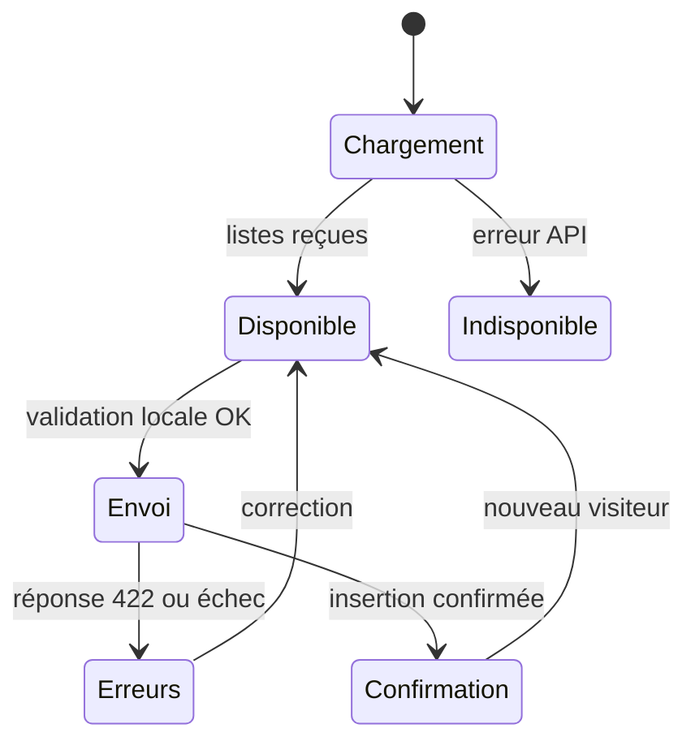

# 06 — Construire un front qui fait le travail, sans maquettes

## Choisir un parcours court

Le visiteur est debout dans un salon, sur un petit écran et parfois avec une connexion moyenne. Une page unique organisée en trois blocs suffit : coordonnées, projet de formation, remarque et validation. Il doit comprendre en quelques secondes pourquoi il remplit cette fiche et ce que confirme le bouton.

Le starter reprend déjà les dix champs, les libellés, le calendrier natif, les attributs d’autocomplétion et les listes issues de l’API. Votre travail est de terminer les états et la validation intégrée, puis de vérifier l’usage réel. N’ajoutez pas un assistant de cinq pages pour obtenir dix champs.

| Zone | Contenu | Choix de composant |
|---|---|---|
| En-tête | Nom de l’application, école et salon | Bandeau sobre, pas de grand visuel prenant tout l’écran |
| Coordonnées | Nom, prénom, naissance, téléphone, mail | `input`, `type=date`, `type=tel`, `type=email` |
| Projet | Classe, école, niveau, spécialité | `select`, première option explicite et facultatifs compréhensibles |
| Remarque | Souhait particulier | `textarea`, limite visible si utile |
| Information données | Notice réelle et contact | Texte lisible, lien si notice détaillée |
| Action | Enregistrer ma visite | `btn btn-primary`, pleine largeur sur mobile |
| Résultat | Confirmation ou erreur | `alert`, `role=alert`, focus adapté |

Le formulaire tient sur une colonne à 360 px et deux colonnes pour les petits champs à partir du breakpoint `sm`. La carte centrale ne dépasse pas `max-w-3xl`. Les labels restent au-dessus des champs ; un placeholder ne remplace jamais un label.

## Quatre états indispensables



Pendant le chargement des référentiels, le bouton est désactivé. Pendant l’envoi, il affiche « Enregistrement en cours… ». En cas d’erreur, aucune saisie ne disparaît. Sur réussite, montrez une confirmation claire, la référence et une action permettant de commencer une nouvelle fiche. Vérifiez l’API avant d’afficher ce résultat ; la page ne peut pas déduire une réussite du seul clic.

En cas d’erreur champ, affichez le texte près du champ, ajoutez `aria-invalid=true`, reliez le texte avec `aria-describedby` et placez le focus sur le premier champ concerné. Une alerte globale explique qu’il faut corriger. Ne transmettez pas un message technique SQL au visiteur.

## Exemple d’affichage sûr

```js
const paragraph = document.createElement('p');
paragraph.textContent = registration.remark || 'Aucune remarque';
container.append(paragraph);
```

Cette technique affiche littéralement `<script>...</script>` sans l’exécuter. Évitez `innerHTML` sur toutes les coordonnées et remarques. Les labels d’API sont aussi affichés par `textContent`. Le projet ne nécessite pas un framework JS complet : modules JavaScript et fonctions courtes suffisent.

## Le calendrier et le téléphone

`input type=date` affiche le sélecteur du navigateur et transmet `YYYY-MM-DD`. Ne passez pas par `new Date(value).toISOString()` pour une date de naissance : c’est une date civile, pas un instant UTC. Le calendrier dépend de la plateforme ; testez au moins un vrai téléphone.

Le numéro reste une chaîne. Ne faites pas un `parseInt`, qui détruirait le zéro initial et le préfixe international. Utilisez `autocomplete=tel`, un message de format souple et la validation serveur du contrat. Les noms acceptent des accents et apostrophes ; une regex limitée à A–Z serait inadaptée.

## Tableau de bord mobile

Après connexion, affichez le salon, le total, les filtres et la liste. L’écran d’accueil de l’équipe doit servir à retrouver une personne, pas à présenter tous les champs sur une seule ligne.

- Desktop : `table` avec nom/prénom, école/niveau, heure et bouton Détails.
- Mobile : cartes courtes, mêmes informations essentielles ; détail dans une section ou `modal` accessible.
- Filtres : école + niveau, bouton Appliquer et Réinitialiser ; affichez le périmètre des totaux.
- Récapitulatif : tableau de groupes avec total, puis CSV, PDF et envoi à une adresse.
- Navigation : connexion, état de session, déconnexion visible. Une expiration efface les données privées de l’écran.

Les compteurs doivent venir du serveur. « — » dans le starter signifie « pas encore chargé », pas zéro. Prévoyez les états vide, chargement, erreur, connecté et expiré. La pagination vient de l’API et ne se limite pas à masquer une liste complète déjà téléchargée.

## Astuces Tailwind/daisyUI

Le starter utilise Tailwind 4 et daisyUI 5 via le plugin Vite : `@import "tailwindcss"` et `@plugin "daisyui"`. Il ne suit pas la procédure Tailwind 3 avec un ancien `tailwind.config.js`. Choisissez les composants dans la documentation officielle correspondant à cette version.

Privilégiez `gap-4`, `p-4 sm:p-6`, `space-y-4`, `rounded-box`, `bg-base-100`, `text-base-content`. Gardez un thème clair, du contraste et des boutons d’environ 44 px ou plus. Ne codez pas des noms de classes Tailwind par concaténation dynamique que le build ne peut pas détecter ; utilisez une liste de classes littérales.

Restez sobre : pas d’animations bloquantes, pas de CAPTCHA externe ajouté sans accord, pas de police distante indispensable, pas de thème sombre imposé. Les ressources sont compilées dans l’image pour fonctionner sans CDN.

## Votre preuve de fin

Captures à 360 et 1280 px avec données fictives, navigation clavier, essai du calendrier, erreur par champ, absence de perte de saisie, erreur réseau, double clic et confirmation après une vraie insertion. Faites tester par un étudiant d’un autre pôle sans l’aider : les hésitations donnent les corrections à apporter.
