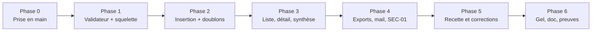

# Pôle 4 — Roadmap backend (API, sécurité)

Complète la [fiche de pôle](04-backend.md) : elle dit **quoi** livrer, cette roadmap dit **dans quel ordre**, **avec qui** et **avec quelle preuve**. Le [guide backend](04-backend-guide.md) donne le **comment** (code, commandes, pièges).

Les temps sont cumulés depuis le début de la journée de 7 h ([02 — Organisation](../02-organisation.md)). Adaptez-les à l’heure réelle ; l’ordre et les dépendances comptent plus que les minutes.

## Vue d’ensemble

| Phase | Cumul     | Objectif backend                            | Tâches                     | Preuve de sortie                                                       |
| ----- | --------- | ------------------------------------------- | -------------------------- | ---------------------------------------------------------------------- |
| 0     | 0:00–0:30 | Poste prêt, starter compris, noms attribués | —                          | `composer test` + `composer smoke` verts sur chaque poste              |
| 1     | 0:30–1:15 | Validateur sans base + routes séparées      | API-01                     | Tests du validateur verts ; exemples 422 envoyés au front              |
| 2     | 1:15–2:00 | Premier POST jusqu’à PostgreSQL             | API-02                     | `curl` → 201 + ligne en base ; 2ᵉ envoi → 409                          |
| 3     | 2:00–3:30 | Lecture protégée + synthèse unique          | API-03, API-04             | Liste paginée exacte, détail 404 hors salon, total = somme des groupes |
| 4     | 3:30–4:30 | Exports, envoi, durcissement                | SEC-01, appui EXP-01/02/03 | Matrice des routes (401/403/200) automatisée                           |
| 5     | 4:30–5:30 | Corriger les anomalies de la recette        | QA-02                      | Anomalies P0 backend à zéro                                            |
| 6     | 5:30–7:00 | Gel, variables, fiche individuelle          | IND-01, DOC-01             | Tag posé, preuves liées aux PR                                         |

**Rendez-vous de 10 min** (voir 02) : après la conception (≈ 1:15), au premier parcours complet (≈ 3:30), avant la bascule (≈ 5:30). Montrez une preuve, pas un pourcentage.

## Répartition proposée (3 personnes)

| Rôle                     | Tâches                                          | Fichiers principaux                                                                                       | Relecteur |
| ------------------------ | ----------------------------------------------- | --------------------------------------------------------------------------------------------------------- | --------- |
| **A — Écriture**         | API-01, API-02                                  | `src/Registration/Validator.php`, `Repository.php`, `src/Routes/registrations.php`, `tests/validator.php` | B         |
| **B — Lecture**          | API-03, API-04                                  | `src/Registration/Filters.php`, `src/Summary/SummaryService.php`, `src/Routes/admin.php`                  | C         |
| **C — Sécurité & tests** | SEC-01, tests d’intégration, appui exports/mail | `tests/registrations.php`, `tests/smoke.php`, `tests/security.php`                                        | A         |

À deux : A prend API-01/02 puis SEC-01, B prend API-03/04 puis les exports. Seul : API-01 → API-02 → API-03 → API-04 → SEC-01, dans cet ordre exact. Inscrivez vos noms dans [REPARTITION.md](../../livrables/REPARTITION.md) **avant** de coder.

## Phase 0 — Prise en main (0:00–0:30)

- [x] Cloner, `cp .env.example .env`, `docker compose up -d --build --wait`, `docker compose exec api php bin/create-admin.php equipe`.
- [x] `composer test` et `composer smoke` verts **avant** toute modification (base de comparaison).
- [x] Lire dans cet ordre : `public/index.php` → `src/app.php` → `Http/Json.php` → `Infrastructure/Database.php` → `Security/*` → `tests/smoke.php`.
- [x] Lire [05 — Contrat API](../05-contrat-api.md) en entier. C’est votre cahier des charges, y compris les codes HTTP.
- [x] Se répartir (tableau ci-dessus), choisir les relecteurs, convenir des fichiers pour éviter les collisions.
- [ ] Poser les **questions de décision** au pilotage (à tracer dans [DECISIONS.md](../../livrables/DECISIONS.md)) :
  - propriétés inconnues ou sensibles dans le JSON : rejetées en 422 ou ignorées ? (recommandation : champs sensibles refusés, autres ignorés) ;
  - `remark` vide stocké comme `''` ou `NULL` ;
  - normalisation e-mail (minuscules) identique à l’index unique de la base ;
  - `pages` vaut-il 0 quand il n’y a aucune fiche.

## Phase 1 — Validateur et squelette (0:30–1:15) · API-01

Le pôle données n’a pas fini la migration : **ce travail n’en dépend pas**.

- [x] Ouvrir une première PR **courte** qui ne fait que déplacer les routes hors de `app.php` (`src/Routes/registrations.php`, `src/Routes/admin.php`) sans changer le comportement. Une fois mergée, A et B ne se marchent plus dessus. `composer smoke` doit rester vert.
- [ ] `src/Registration/Validator.php` : fonction pure `validate(array $body, array $ids, DateTimeImmutable $today)` → `values` + `errors`, sans base ni HTTP.
- [ ] `tests/validator.php` : une règle du contrat par test (T03, T04, T05, T06, T07 ci-dessous), enregistré dans `composer test`.
- [ ] **Avant 1:15** : envoyer au front un exemple 422 avec les vrais noms de champs et confirmer que les ID partent en **nombres JSON** (pas `"3"`).
- [ ] **Avant 1:15** : confirmer avec le pôle données les noms de colonnes (ceux de [04 — Données](../04-donnees-merise.md)) et la **règle de doublon** exacte.

**Terminé quand :** `composer test` passe, un body invalide ne passe jamais le validateur, chaque erreur porte le nom du champ du formulaire.

## Phase 2 — Insertion et doublons (1:15–2:00) · API-02

Dépend de DATA-03 (migration `003_registrations.sql`). En attendant : écrire le `Repository` sur les colonnes convenues.

- [ ] `Repository::insert()` avec **liste de colonnes écrite en dur** (jamais le body brut dans `insert()`).
- [ ] UUID v4 généré côté serveur, horodatage par le défaut SQL `registered_at`.
- [ ] Route `POST /api/registrations` : ordre fermé (503) → 415 → 400 → 422 → INSERT → 201.
- [ ] `23505` → 409 `DUPLICATE_REGISTRATION` ; `23503` → 422 ; tout autre cas → 500 neutre (jamais « doublon » par défaut).
- [ ] Le 501 `NOT_IMPLEMENTED` disparaît **uniquement** quand l’INSERT réel existe. Le 503 « fermé » reste le comportement par défaut tant que `REGISTRATIONS_OPEN=false` (la CI le vérifie).
- [ ] Test de concurrence (8 requêtes identiques en parallèle → 1 × 201 + 7 × 409 + 1 seule ligne).
- [ ] Fournir au front : exemples **201 / 422 / 409 / 503 / 400 / 415**.

**Terminé quand :** les critères de [04-backend.md](04-backend.md) sur l’inscription sont prouvés : une valide → 201 _après_ écriture ; une invalide → aucune ligne ; doublon concurrent → une ligne.

## Phase 3 — Lecture protégée et synthèse (2:00–3:30) · API-03, API-04

Dépend de DATA-03/04 (table + jeu fictif). Les requêtes se préparent dès la phase 2.

**API-03 — liste et détail**

- [ ] `Filters::fromQuery()` : `page`, `per_page` (max 100), `school_id`, `entry_level_id` → 422 si invalide, y compris tableaux (`page[]=1`) et chaînes vides.
- [ ] Liste : tri fixe `registered_at DESC, id DESC`, `LIMIT/OFFSET` liés, total calculé avec **les mêmes filtres**, périmètre = salon actif (`EVENT_ID` serveur).
- [ ] Détail : dix champs + libellés + date ; 404 si inexistant **ou** autre salon.
- [ ] La liste n’expose pas téléphone, e-mail ni date de naissance.
- [ ] Routes dans le groupe `/api/admin` (Auth puis CSRF), jamais à côté.

**API-04 — synthèse**

- [ ] `SummaryService::build()` : **une seule** fonction → JSON, CSV, PDF, mail. Total = somme des `count` du même résultat.
- [ ] `GET /api/admin/summary` avec filtres école/niveau, forme exacte du contrat.
- [ ] Transmettre à B/EXP : forme des groupes `{school_id, school, entry_level_id, entry_level, count}`.

**Terminé quand :** > 20 fiches, aucun oubli ni doublon entre pages (T15) ; plusieurs écoles/niveaux, somme des groupes = total (T16) ; zéro fiche → total 0 (T17).

## Phase 4 — Exports, envoi et SEC-01 (3:30–4:30)

- [ ] Brancher `GET /admin/exports/{csv|pdf}` sur `SummaryService` + `SummaryExport` (en-têtes `Content-Disposition`, `no-store`, nom de fichier construit côté serveur). Appui à EXP-01/02.
- [ ] `POST /admin/summary/email` : validation 422, allowlist 403, SMTP 503, limite d’envoi, jamais de secret dans la réponse ni les logs. Appui à EXP-03 ; **tests avec relais de test uniquement**.
- [ ] **SEC-01** : matrice automatisée de toutes les routes (anonyme / sans CSRF / connecté) ajoutée à `tests/smoke.php` ou `tests/security.php`.
- [ ] Limite applicative sur `POST /registrations` (en plus de Nginx), réglée large : le salon peut partager une IP.
- [ ] Relecture des logs après tests : aucune saisie, aucun SQL, aucun secret.
- [ ] Variables d’environnement nouvelles → à INF avec une valeur type, jamais un secret.

**Terminé quand :** chaque route privée répond 401 à un anonyme, 403 sans jeton (POST) et fonctionne une fois connecté ; le tout est dans un test relançable.

## Phase 5 — Recette (4:30–5:30)

- [ ] Prendre en charge les anomalies backend de QA ; reproduire par un test **avant** de corriger.
- [ ] Rejouer T01–T28 du périmètre backend (tableau ci-dessous) avec QA, pas seul.
- [ ] Ne pas ajouter de fonctionnalité. Tout ce qui n’est pas P0/P1 reste dans « Après livraison ».

## Phase 6 — Gel et preuves (5:30–7:00)

- [ ] Gel de `src/` : seules les corrections bloquantes passent, avec accord du coordinateur.
- [ ] Mettre à jour [05 — Contrat](../05-contrat-api.md) si une réponse a changé, et [DECISIONS.md](../../livrables/DECISIONS.md).
- [ ] Relire les variables exigées en production : `bin/check-config.php` ne contrôle aujourd’hui que `APP_SECRET`, `DB_PASSWORD`, `APP_URL` et `APP_DEBUG` ; ajoutez ce qui manque si besoin (`SUMMARY_RECIPIENT_ALLOWLIST`, SMTP pour le P1) et vérifiez que toute variable nouvelle figure aussi dans `compose.yaml` (guide, section 10).
- [ ] Fiche individuelle ([MODELE.md](../../livrables/individuel/MODELE.md)) : PR, un test normal, un test d’erreur, une décision technique, une difficulté résolue. **Le login fourni n’est pas votre production** : citez ce que vous avez vérifié ou étendu.
- [ ] Tester `ouverture` : `REGISTRATIONS_OPEN=true` puis recréation du conteneur API (`docker compose up -d --force-recreate api`).

## Couverture de la matrice de tests (périmètre backend)

| Test                                                | Phase | Qui | Preuve                                 |
| --------------------------------------------------- | ----- | --- | -------------------------------------- |
| T01 valide → 201                                    | 2     | A   | test d’intégration + `curl`            |
| T02 accents/apostrophes                             | 2     | A   | valeur relue en base identique         |
| T03 champ absent/blanc                              | 1     | A   | `tests/validator.php`                  |
| T04 date invalide/future                            | 1     | A   | `tests/validator.php`                  |
| T05 téléphone `+33`, zéro initial                   | 1     | A   | `tests/validator.php`                  |
| T06 e-mail invalide/> 254                           | 1     | A   | `tests/validator.php`                  |
| T07 ID inconnu/chaîne/bool/tableau                  | 1     | A   | `tests/validator.php` + POST réel      |
| T08 deux requêtes simultanées                       | 2     | C   | script parallèle                       |
| T09 même mail, noms différents                      | 2     | C   | 2 × 201                                |
| T11 accès direct sans session                       | 4     | C   | matrice SEC-01                         |
| T12 mauvais mot de passe puis 429                   | 4     | C   | test login (dans `smoke.php` pour 401) |
| T13 actions sans CSRF                               | 4     | C   | matrice SEC-01                         |
| T14 session expirée                                 | 4     | C   | simulation `last_activity`             |
| T15 pagination > 20                                 | 3     | B   | jeu fictif de 45 fiches                |
| T16 somme des groupes                               | 3     | B   | test SQL + HTTP                        |
| T17 zéro fiche                                      | 3     | B   | base vide                              |
| T20 mail autorisé/interdit/SMTP KO                  | 4     | C   | faux relais                            |
| T26 corps trop grand / JSON invalide / mauvais type | 2     | A   | 413 / 400 / 415                        |
| T27 inscriptions fermées                            | 2     | A   | 503 avec `REGISTRATIONS_OPEN=false`    |

## Dépendances et échanges

| J’attends de | Quoi                                                | Pour               | À obtenir avant |
| ------------ | --------------------------------------------------- | ------------------ | --------------- |
| Données      | Noms de colonnes + règle de doublon                 | Repository, API-01 | 1:15            |
| Données      | `003_registrations.sql` mergée                      | API-02             | 1:15            |
| Données      | Jeu fictif (45+ fiches, 2 écoles, doublons de mail) | API-03/04, T15–T17 | 2:00            |
| Front        | ID envoyés comme entiers, pas de `school_id=` vide  | Validation stricte | 1:15            |
| Infra        | Clarifier 413/429 de Nginx (réponses non JSON)      | Gestion d’erreurs  | 3:30            |

| Je fournis à        | Quoi                                                 | Quand          |
| ------------------- | ---------------------------------------------------- | -------------- |
| Front               | Exemples 201/422/409/503/400/415 avec vrais champs   | 1:15 puis 2:00 |
| Données             | Besoins de contraintes/index vus à l’usage           | dès constat    |
| Exports/back-office | Forme de `/admin/summary`, filtres, `SummaryService` | 3:00           |
| QA                  | Commande de tests + liste des routes refusées        | 3:30           |
| Infra               | Variables nouvelles (valeur type, pas de secret)     | dès ajout      |

## Risques et parades

| Risque                                                                   | Parade                                                                                                            |
| ------------------------------------------------------------------------ | ----------------------------------------------------------------------------------------------------------------- |
| Migration 003 en retard                                                  | Repository codé sur les colonnes de la doc 04 ; validateur déjà livré ; ne pas inventer de schéma local divergent |
| Conflits sur `src/app.php`                                               | PR de découpage des routes en tout premier ; plus personne n’y ajoute de route après                              |
| Le client envoie `"3"` au lieu de `3`                                    | Accord explicite avec le front, test T07 en démonstration                                                         |
| Doublon traité par SELECT puis INSERT                                    | Interdit : la base impose l’unicité, l’API intercepte 23505                                                       |
| Fuite via les logs                                                       | Ne jamais logguer `getMessage()` d’une `PDOException` (le détail PostgreSQL contient e-mail et noms)              |
| Limite d’IP bloquant de vrais visiteurs (réseau mobile ou Wi-Fi partagé) | Seuil applicatif large, test avec l’infra, jamais `X-Forwarded-For` libre                                         |
| Medoo ne sait pas exprimer une requête                                   | Requête SQL brute paramétrée avec fragments fixes (modèle dans le guide)                                          |
| Dérive de périmètre                                                      | Rien hors P0/P1 avant que T01–T28 backend soient verts                                                            |

## Après livraison (P2, pas avant)

Clé d’idempotence pour récupérer une confirmation perdue, correction de fiche avec journal d’actions, recherche nom/e-mail, purge selon politique validée, gestion des comptes, export nominatif avec habilitation. Chacune réclame besoin, protection, tests et documentation ([08 — Backlog](../08-backlog.md)).
